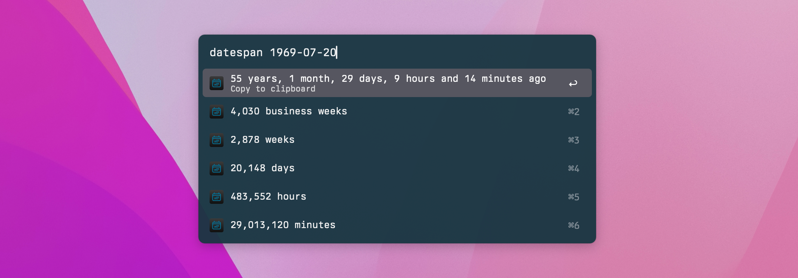

# Alfred Datespan Workflow

Get human-formatted date/time intervals with Alfred.

Custom theme using [Berkeley Mono](https://berkeleygraphics.com/typefaces/berkeley-mono/).

## Installation

Download the `.alfredworkflow` file from the [latest release](https://github.com/mattstein/alfred-datespan-workflow/releases) and double-click to install.

## Usage

Use this workflow to get the difference between two dates in Alfred. This relies exclusively on PHP’s [DateInterval](https://www.php.net/manual/en/dateinterval.format.php) method, which is happy to accept a variety of inputs and works pretty well!

Examples:

- `datespan tomorrow`: countdown in hours and minutes
- `datespan 10/10/10`: difference in years, months, days, hours, and minutes—along with total business weeks, weeks, days, hours, and minutes
- `datespan 3/10 to 5/12`: all units above, but the span between zero-hour on each date

You can use any format that [`strtotime`](https://php.net/manual/en/function.strtotime.php) can parse.
